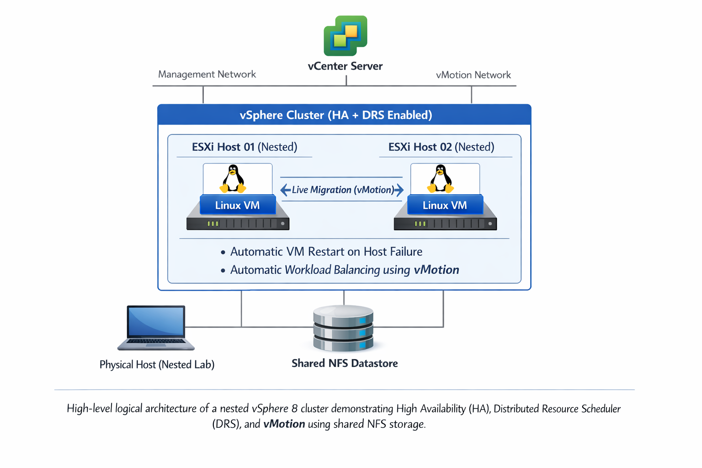

# vSphere Self‑Healing Cluster | Nested ESXi Home Lab

## Overview
This project demonstrates core VMware vSphere technologies that enable
enterprise‑grade availability, resiliency, and live workload mobility.

A nested vSphere 8 cluster was built to showcase how modern virtualized
environments automatically recover from host failures and rebalance workloads
without administrator intervention.

---

## 🔧 Lab Stack
- VMware vSphere 8
- Nested ESXi hosts
- vCenter Server
- vSphere High Availability (HA)
- Distributed Resource Scheduler (DRS)
- vMotion
- Shared NFS Datastore
- Linux Virtual Machines

---

## 🧱 Architecture

High-level logical architecture of a nested vSphere 8 cluster demonstrating
High Availability (HA), Distributed Resource Scheduler (DRS), and vMotion
using shared NFS storage.

## 🎥 Demonstrations

### 1️⃣ vMotion — Live Migration
Demonstrates live migration of a running Linux virtual machine between ESXi hosts
with no service interruption.

📂 Demo details:  
`demos/01-vmotion`  
🎥 Loom demo: https://lnkd.in/eCGevx67

---

### 2️⃣ High Availability (HA)
Simulates an ESXi host failure and demonstrates automatic virtual machine recovery
on a surviving host.

📂 Demo details:  
`demos/02-ha`  
🎥 Loom demo: https://lnkd.in/eQ6Am2Tu

---

### 3️⃣ Distributed Resource Scheduler (DRS)
Introduces CPU resource contention and demonstrates automatic workload
rebalancing through vMotion.

📂 Demo details:  
`demos/03-drs`  
🎥 Loom demo: https://lnkd.in/eCGevx67

---

## ✅ Outcome
- Zero‑downtime live migration validated
- Automatic failover successfully verified
- Intelligent resource balancing demonstrated
- No manual administrator intervention required

---

## 📌 Notes
This project was implemented in a nested home lab to simulate real‑world
enterprise virtualization behavior and operational workflows.
